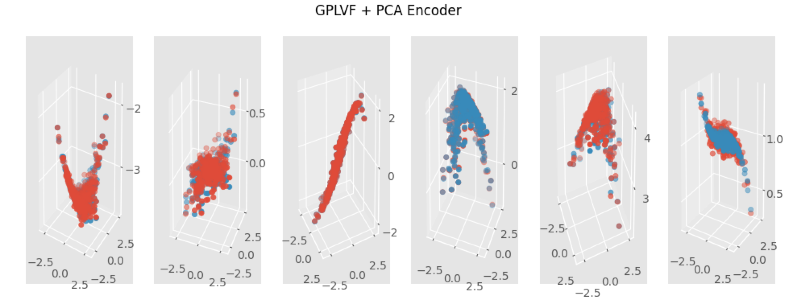
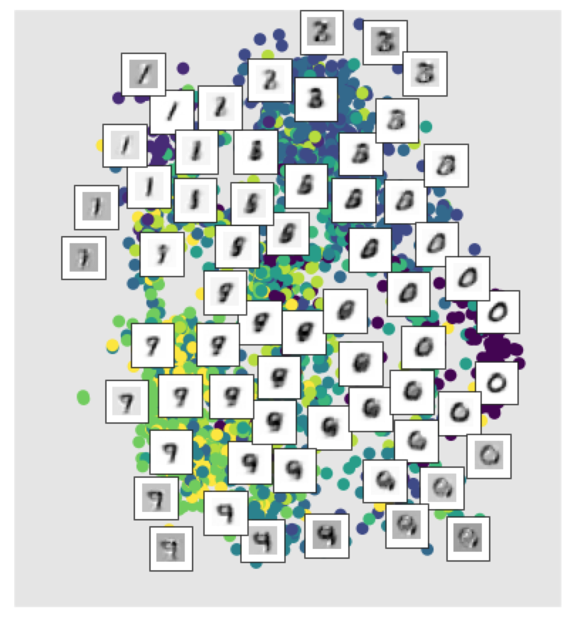

# GPLVFs

This is the code behind our paper:

> Variational Gaussian Process Latent Variable Models with Normalizing Flows

As an illustration, this is what a typical run looks like at the moment:

```python

from gplvf import model, data

import matplotlib.pyplot as plt
plt.ion(); plt.style.use('ggplot')

n, d, q, X, Y, lb = data.generate_synthetic_data(x_type='normal', y_type='hi_dim')

gplvf = model.GPLVF(Y, q)
gplvf.init_decoder()
gplvf.init_encoder(model='pca', num_flows=10, activate_flow=True)

losses = gplvf.train(steps=2000)

X_recon = gplvf.enc_flow.X_map(n_restarts=1)
gplvf.decoder.X = X_recon
Y_recon = gplvf.y_given_x(X_recon)

data.check_model(X, Y, Y_recon, 'GPLVF + PCA Encoder')
```



The MNIST plot can be generated using:

```python
import os; os.chdir('tests')
from test_model import MNISTPlotsAndSDInits

MNISTPlotsAndSDInits().test_missing_mnist_plots_and_inits()

```


